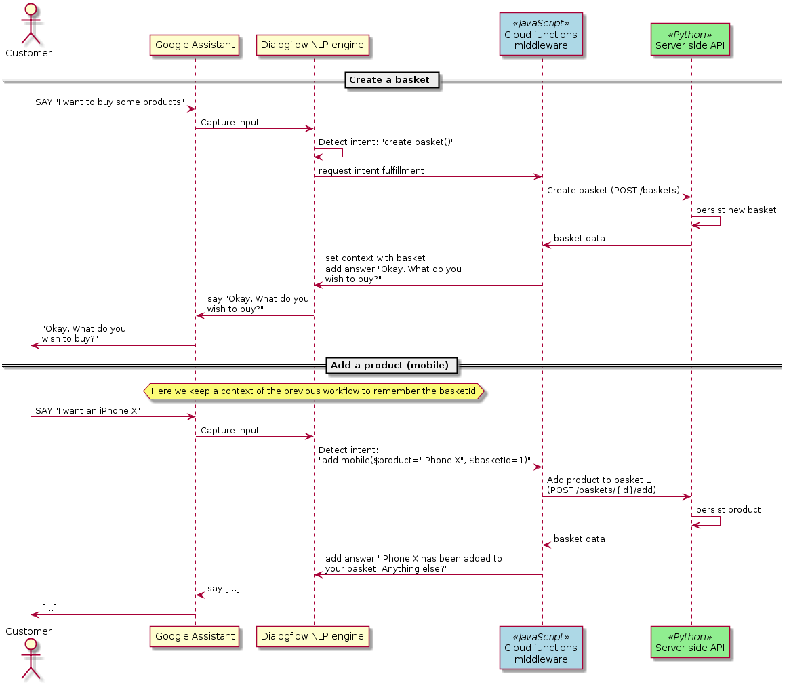

# Vodafone technical test

## High-level design

Here below is the workflow of the entire system: 



### Server side API design

#### Technology stack

For the backend, the technology stack is the following:
* ``Python`` as the programming language. This choice is mainly motivated by my
  personal proficiency and the fact that performance is not a concern in a
  small scale project.
* ``apistar`` as the framework for buidling the API. Other alternatives such as
  ``flask`` were also on the table but the decision was made towards
  ``apistar`` since it has the same level of verbosity and ease of use as
  ``flask`` but provides an ``OpenAPI 3.0.0`` API specification out of the box.
  This hence provides a better documentation for any reviewer to go through. 
* ``peewee`` as the ORM. This choice was made due to its simplicity when
  compared to the well-known ``sqlalchemy`` ORM. Since simplicity is very
  advantageous when realising a small project as it allows better readability
  of the codebase. I believe that makes it a very good choice.

#### Design

Referring to figure 1, you can see in green the technical component that
represents the server-side API.
This service is exposed via a REST API using and provides an OpenAPI schema
that can be used to generate any client code (useful if later we migrate to a
custom webhook). Although the application uses an ORM for persisting data, 
the altter is only an in-memory database which means that all data are lost
whenever the process is terminated. However, this can be changed reasonably
quickly in an hypothetical future.

PLease also note that functional tests were written and are available under
the `basket_manager.tests` package.

### Middleware design

#### Technology stack

In order to connect the backend API to a chatbot, the choice was made to
integrate it with the `Google assistant` using the Google-provided
``dialogflow`` NLP framework.

Since I personally did not have any prior experience with any chatbot
technology, this choice was not motivated by any major reason apart from the
fact that I am more accustomed to other Google technologies when compared to
Amazon with `Amazon Alexa` for example.

In order to create this middleware, connectors had then to be made between the
voice/keyboard inputs being intepreted by ``dialogflow`` and the server-side
API which is responsible to fulfill the incoming user intents.
Two alternatives were then available:
* Building a custom webhook that would be called in order to fulfill intents.
  The advantage of this approach is the level of flexibility that you get
  since you own and manage all the code being executed. It also allows you to
  choose your programming language of choice.
* Using the inline editor in order to implement cloud functions for Firebase.
  This options is a better choice when it comes to simplicity. Indeed,
  this comes with an automatic deployment via Google cloud and an access to
  all complete set of debugging tools straight out of the box. However, it
  requires one to use node.js as the programming language for implementing the
  middleware.

Given these two choices, I opted again for simplicity by using the cloud
functions for ``firebase`` as the main objective is not to provide a complex
middleware for now, but rather a simple middleware that glues together the
business logic in the backend service and the chatbot interface.

#### Design

Referring to figure 1, you can see in blue the technical component that
represents the middleware. As previously mentionned, all the middleware are
made up of cloud functions that are all located in a single file under the
`middleware/` folder.

## Setup instructions

All the code is available at https://github.com/v-francoise/basket-manager/.

### Server-side API deployment

> NOTE: I did not finish the deployment of the server-side API however I will
> try to give some indications on how I intended to deploy it.

Using the ``app.yaml`` file provided, one should be able to deploy this
application onto Google cloud (app engine).

``` sh
gcloud app deploy
```

You should then see the following output
``` sh
Services to deploy:

descriptor:      [<PROJECT_PATH>/app.yaml]
source:          [<PROJECT_PATH>]
target project:  [<GCLOUD_PROJECT>]
target service:  [default]
target version:  [20180829t232741]
target url:      [https://<GCLOUD_PROJECT>.appspot.com]


Do you want to continue (Y/n)?  

Beginning deployment of service [default]...
Created .gcloudignore file. See `gcloud topic gcloudignore` for details.
[...]
```

### Middleware deployment

In order to deploy the Dialogflow configuration and the middleware:

Compress the `dialogflow/` folder as a zip:

``` sh
zip -r dialogflow.zip dialogflow
```

Then, import the dialogflow.zip into [a new dialogflow agent](
https://console.dialogflow.com/api-client/#/newAgent) 

After that, you will have to import the middleware. To do so, go to
https://console.dialogflow.com/api-client/#/agent<AGENT_ID>/fulfillment and
activate the inline editor. Once enabled, copy/paste the content of
`middleware/main.js` into the editor. Then, before clicking on "Deploy", change
the `apiHost` and the `apiPort` constants to match the endpoint for reaching
the server-side API.

In my case, it should be somthing like:
* apiHost: https://basket-manager-b17a2.appspot.com
* apiPort: 8080

